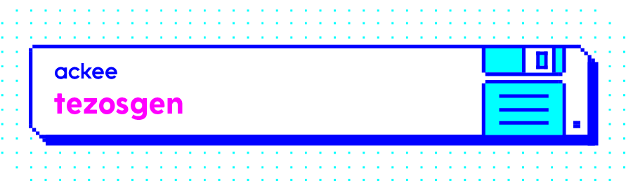

[](http://cocoapods.org/pods/TezosGen)
[](http://cocoapods.org/pods/TezosGen)
[](https://github.com/apple/swift-package-manager)
[](http://cocoapods.org/pods/TezosGen)

## What's tezosgen

tezosgen is a smart contract code generator - you just specify the smart contract's specification and tezosgen generates type-safe `.swift` files, so using smart contracts in your iOS or Mac app has never been easier!

This project has been published as a part of [Tezos-iOS-Dev-Kit](https://github.com/AckeeCZ/Tezos-iOS-Dev-Kit)

## Installation

There are multiple possibilities to install tezosgen on your machine or in your project, depending on your preferences and needs. Note that if you do not install `tezosgen` using `Cocoapods`, you will have have to import `TezosSwift` by yourself.

<details>
<summary>Using <strong>Homebrew</strong></summary>

```bash
$ brew tap AckeeCZ/tezosgen
$ brew install tezosgen
$ tezosgen
```

---
</details>
<details>
<summary>Via <strong>CocoaPods</strong></summary>

If you're using CocoaPods, you can simply add `pod 'TezosGen' ~> 1.1.1` to your `Podfile`.

This will download the `tezosgen` binaries and dependencies in `Pods/` during your next `pod install` execution.

Given that you can specify an exact version for ``tezosgen`` in your `Podfile`, this allows you to ensure **all coworkers will use the same version of tezosgen for this project**.

You can then invoke tezosgen from your terminal:
```sh
Pods/tezosgen/tezosgen …
```

_Note: tezosgen isn't really a pod, as it's not a library your code will depend on at runtime; so the installation via CocoaPods is just a trick that installs the tezosgen binaries in the Pods/ folder, but you won't see any swift files in the Pods/tezosgen group in your Xcode's Pods.xcodeproj. That's normal: the tezosgen binary is still present in that folder in the Finder._

---
</details>
<details>
<summary><strong>Swift Package Manager</strong></summary>

Add this to your `Package.swift`:

```swift
.package(url: "https://github.com/AckeeCZ/tezosgen.git", .upToNextMajor(from: "1.1.1")),
```

</details>

### iOS MVVM Project Template

We have also created iOS MVVM Project Template, so setting your project has never been easier. 
Easily follow the [installation instructions](https://github.com/AckeeCZ/iOS-MVVM-ProjectTemplate).
After you are done, add `name_of_your_abi.json` file to `Resources`. Then add `tezosgen` to your `Podfile`, do `pod install` and run this command in your project root directory:
```sh
Pods/tezosgen/tezosgen HelloContract NameOfYourProject/Resources/abi.json -x NameOfYourProject.xcodeproj -o NameOfYourProject/Model/Generated/GeneraredContracts
```

## Usage

### Example

You can find an example app [here](https://github.com/AckeeCZ/TezosSwift).

### How to Get Contract Specifcation

To be able to generate smart contract code, we first need to have its specification. To find it, simply run `curl https://url_to_your_node/chains/main/blocks/head/context/contracts/contract_address | tr -d '\n'`.

The output could look something like this:

```{"manager":"tz1dD918PXDuUHV6Mh6z2QqMukA67YULuhqd","balance":"21000000","spendable":false,"delegate":{"setable":false},"script":{"code":[{"prim":"parameter","args":[{"prim":"set","args":[{"prim":"nat"}]}]},{"prim":"storage","args":[{"prim":"set","args":[{"prim":"nat"}]}]},{"prim":"code","args":[[{"prim":"CDR"},{"prim":"NIL","args":[{"prim":"operation"}]},{"prim":"PAIR"}]]}],"storage":[{"int":"1"},{"int":"2"},{"int":"3"}]},"counter":"0"}```

What we need for our generator is hidden under the `code` key and we need to obtain the parameter and storage. So the specification for this contract, after a little modification, would look like this: 

```{"parameter": {"prim":"set","args":[{"prim":"nat"}]}, "storage": {"prim":"set","args":[{"prim":"nat"}]}}```

To expand on this, the specification should look like this:

```{"parameter": {code_specified_under_args_for_parameter}, "storage": {code_specified_under_args_for_parameter}```

By defaul the parameters are then indexed from number one for better readability, but you can also name your parameters! (and if the values are named in the contract itself, you will get this for free). To do this, it would look like this: 
```{"parameter": {"prim":"set", "annots":["%first"],"args":[{"prim":"nat"}]}, "storage": {"prim":"set","args":[{"prim":"nat"}]}}```

(that is add to the type a new key-value pair `"annots":["%desired_name"]`)

### Codegen
The standard usage looks like this `tezosgen HelloContract path_to_abi/abi.json -x path_to_xcodeproj/project.xcodeproj -o relative_output_path`

Please <strong>note</strong> that the output path option (`--output`) should be relative to your project - if your generated files are in `YourProjectName/MainFolder/GeneratedContracts` folder, then you should write `--output MainFolder/GeneratedContracts`
For your projects to be bound you also <strong>must</strong> set the `--xcode` option as well. Otherwise you will have to drag the files to your projects manually.

### Combine

If you want to use the generated code with combine, just add this option when you are generating new code:
```bash
--extensions combine
```

### Usage of Generated Codes

The standard call using code created by `codegen` looks like this:
```swift
import TezosSwift
tezosClient.optionalStringContract(at: "KT1Rh4iEMxBLJbDbz7iAB6FGLJ3mSCx3qFrW").call(param1: "hello").send(from: wallet, amount: Tez(1), completion: { result in
    switch result {
    case .failure(let error):
        XCTFail("Failed with error: \(error)")
        testCompletionExpectation.fulfill()
    case .success(_):
        testCompletionExpectation.fulfill()
    }
})
```

`wallet` and `tezosClient` should be created with [TezosSwift](https://github.com/AckeeCZ/TezosSwift)
Also note that right now the created code works with `ReactiveSwift` only.

Result of the call is either a `String` hash of the transaction or an `TezosError`.

